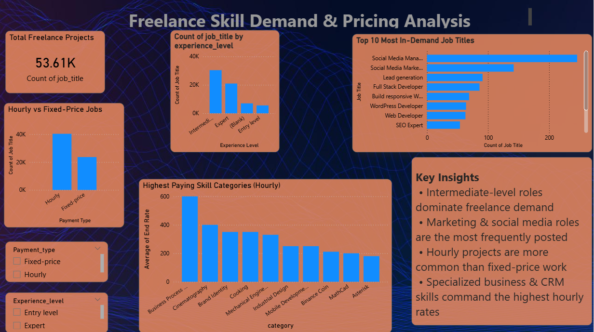

# Freelance Skill Demand & Pricing Analysis

## Project Overview
This project analyzes freelance job postings to understand skill demand, experience-level preferences, pricing patterns, and payment models in the global freelance market.

The analysis was performed using **SQL (MySQL)** for data cleaning and exploration, and **Power BI** for interactive visualization and storytelling.

---

## Tools & Technologies
- MySQL
- SQL (Data Cleaning, Aggregation, Joins)
- Power BI
- GitHub

---

##  Dataset
- Freelance job postings dataset
- Fields include job title, category, experience level, country, payment type, hourly rates, and fixed job cost

---

## Key Analysis Performed
- Cleaned raw data and converted currency fields to numeric values
- Analyzed demand by experience level and job category
- Identified top hiring countries for freelance work
- Compared hourly vs fixed-price projects
- Determined highest-paying freelance skill categories
- Used JOINs for relational analysis
- Built an interactive Power BI dashboard for insights

---

## Dashboard Preview

---

## Key Insights
- Intermediate-level roles dominate freelance demand
- Marketing and social media roles are most frequently posted
- Hourly projects are more common than fixed-price work
- Specialized business and CRM-related skills command the highest hourly rates

---

## SQL Script
- `freelance_analysis.sql` contains all SQL queries used for data cleaning and analysis

---

## Conclusion
This project demonstrates end-to-end data analysis skills, from raw data cleaning to business insight generation and dashboard creation.
