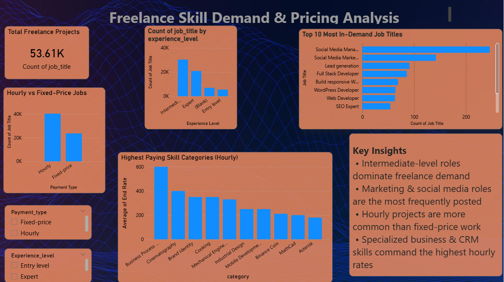

# Freelance Skill Demand & Pricing Analysis

A data analysis project using **SQL (MySQL)** and **Power BI** to uncover which freelance skills are in demand, how pricing varies across job categories, and where the most hiring happens globally.

---

## Dashboard Preview



---

## Problem Statement

The freelance market is highly competitive, yet both freelancers and clients lack clear, data-backed answers to key questions:
- Which skills are clients actually hiring for?
- Does experience level significantly affect job availability?
- Are hourly or fixed-price contracts more common?
- Which countries are the biggest sources of freelance work?

This project answers those questions through SQL-based analysis and an interactive Power BI dashboard.

---

## Repository Structure

```
freelance-skill-demand-analysis/
│
├── freelance_analysis.sql      # All SQL queries (cleaning + analysis)
├── freelance_dashboard.pbix    # Power BI dashboard file
├── dashboard.png               # Dashboard screenshot
└── README.md
```

---

## Dataset

The dataset contains real-world freelance job postings with the following fields:

| Field | Description |
|---|---|
| `job_title` | Title of the freelance job posting |
| `experience_level` | Required experience (Entry / Intermediate / Expert) |
| `category` | Skill/job category (e.g., Marketing, Development) |
| `country` | Client's country |
| `payment_type` | Hourly or Fixed-price |
| `job_cost` | Budget for fixed-price jobs |
| `start_rate` / `end_rate` | Hourly rate range |
| `rating` | Freelancer rating |
| `feedbacks` | Number of client feedbacks |

> **Note:** The raw dataset was cleaned using SQL before analysis. If you'd like to replicate this project, a similar dataset can be found on [Kaggle – Freelance Jobs](https://www.kaggle.com/).

---

## Tools & Technologies

| Tool | Purpose |
|---|---|
| MySQL | Data cleaning, transformation, and analysis |
| Power BI | Interactive dashboard and visualizations |
| GitHub | Version control and project sharing |

---

## Methodology

### 1. Data Cleaning (SQL)
- Created a clean table `freelance_skill_clean` from raw source `freelance_skill_raw`
- Removed `$` signs and commas from monetary fields; cast to `DECIMAL`
- Standardized experience level and payment type fields
- Handled nulls and inconsistent values

### 2. SQL Analysis
Twelve analytical queries were written covering:

- **Experience level demand** — which skill levels clients prefer most
- **Top 10 in-demand categories** — ranked by total job postings
- **Rate segmentation** — jobs bucketed into Low / Medium / High pay within each category
- **Country-wise hiring** — top 10 client countries by job count
- **Hourly vs Fixed-price distribution** — overall payment type breakdown
- **Average hourly rates** — mean start and end rates across all jobs
- **Highest paying categories (hourly)** — top 10 categories by average hourly end rate (minimum 20 jobs)
- **Fixed-price job stats** — average, min, and max fixed project costs
- **Highest paying fixed-price categories** — top 10 by average job cost
- **Relational JOIN analysis** — dimension tables (`dim_category`, `dim_country`) joined with the fact table for cleaner aggregations
- **Country × Category cross-analysis** — highest-paying skill-country combinations for hourly work

### 3. Power BI Dashboard
- Built an interactive dashboard with slicers for category, experience level, and payment type
- Visualized skill demand, pricing trends, and geographic distribution

---

## Key Insights

- **Intermediate-level roles dominate** — the majority of job postings target mid-experience freelancers, not beginners or experts
- **Marketing & Social Media** skills appear most frequently across job categories
- **Hourly contracts outnumber fixed-price** contracts across the platform
- **Business and CRM-related skills** command the highest average hourly rates
- **A handful of countries** (primarily English-speaking markets) account for the bulk of job postings
- Fixed-price budgets vary widely — from small micro-tasks to high-value specialized projects

---

## How to Use

1. **SQL Analysis** — Open `freelance_analysis.sql` in MySQL Workbench or any MySQL client and run the queries on your dataset
2. **Power BI Dashboard** — Open `freelance_dashboard.pbix` in Power BI Desktop to explore the interactive dashboard
3. **Dashboard Preview** — See `dashboard.png` for a quick overview of the visualizations

---
